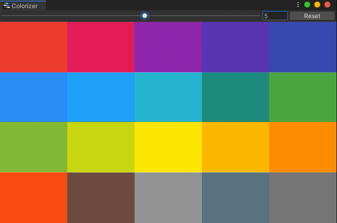

# Material Colors
Color Picker and Color API for material theme colors 

# Editor Window
1. Head to `Window > Tools > Material Colors` to show window
2. `Slider` on top lets you adjust brightness variants and `Reset` button resets to the defaults
3. `Left-Click` copies the color
4. `Right-Click` opens color variants view (only for root view)
5. On color variants view mode, click `Back` to go back root view
6. You can paste the color by right clicking any color on inspector

# Scripting API
1. Include namespace `Excalith.MaterialColors`
2. You can reach all colors and functions through `MaterialColor` class

| Colors                       | Description                                  |
| ---------------------------- | -------------------------------------------- |
| `Red` (int variation)        | Returns the color with variation (default 5) |
| `Pink` (int variation)       | Returns the color with variation (default 5) |
| `Purple` (int variation)     | Returns the color with variation (default 5) |
| `DeepPurple` (int variation) | Returns the color with variation (default 5) |
| `Indigo` (int variation)     | Returns the color with variation (default 5) |
| `Blue` (int variation)       | Returns the color with variation (default 5) |
| `LightBlue` (int variation)  | Returns the color with variation (default 5) |
| `Cyan` (int variation)       | Returns the color with variation (default 5) |
| `Teal` (int variation)       | Returns the color with variation (default 5) |
| `Green` (int variation)      | Returns the color with variation (default 5) |
| `LightGreen` (int variation) | Returns the color with variation (default 5) |
| `Lime` (int variation)       | Returns the color with variation (default 5) |
| `Yellow` (int variation)     | Returns the color with variation (default 5) |
| `Amber` (int variation)      | Returns the color with variation (default 5) |
| `Orange` (int variation)     | Returns the color with variation (default 5) |
| `DeepOrange` (int variation) | Returns the color with variation (default 5) |
| `Brown` (int variation)      | Returns the color with variation (default 5) |
| `Grey` (int variation)       | Returns the color with variation (default 5) |
| `BlueGrey` (int variation)   | Returns the color with variation (default 5) |
| `Grayscale` (int variation)  | Returns the color with variation (default 5) |

| Color Collections      | Description                       |
| ---------------------- | --------------------------------- |
| `Colors`               | Returns all colors and variations |
| `RedVariations`        | Returns colors variations         |
| `PinkVariations`       | Returns colors variations         |
| `PurpleVariations`     | Returns colors variations         |
| `DeepPurpleVariations` | Returns colors variations         |
| `IndigoVariations`     | Returns colors variations         |
| `BlueVariations`       | Returns colors variations         |
| `LightBlueVariations`  | Returns colors variations         |
| `CyanVariations`       | Returns colors variations         |
| `TealVariations`       | Returns colors variations         |
| `GreenVariations`      | Returns colors variations         |
| `LightGreenVariations` | Returns colors variations         |
| `LimeVariations`       | Returns colors variations         |
| `YellowVariations`     | Returns colors variations         |
| `AmberVariations`      | Returns colors variations         |
| `OrangeVariations`     | Returns colors variations         |
| `DeepOrangeVariations` | Returns colors variations         |
| `BrownVariations`      | Returns colors variations         |
| `GreyVariations`       | Returns colors variations         |
| `BlueGreyVariations`   | Returns colors variations         |
| `GrayscaleVariations`  | Returns colors variations         |

| Functions                                 | Descriptions                                 |
| ----------------------------------------- | -------------------------------------------- |
| `GetRandomColorVariation` (int variation) | Returns a random color with variation        |
| `GetRandomColor`                          | Returns a random color with random variation |